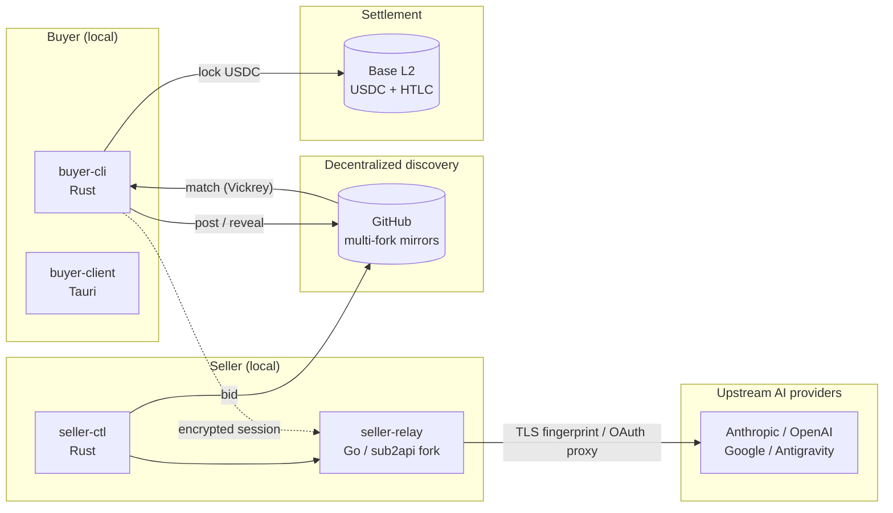
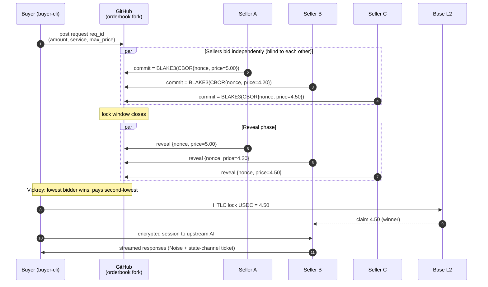

# AI Bazaar

**Language**: **English** · [简体中文](README.zh-CN.md)

**A protocol and reference implementation for a decentralized secondary market of AI subscriptions.**

Sell your unused Claude / OpenAI / Gemini / Antigravity quota anonymously through
sealed-bid auctions — running entirely on GitHub, end-to-end encrypted,
settled on-chain.

[Docs](#-documentation) · [Architecture](#-architecture) · [Protocol](docs/PROTOCOL.md) · [Roadmap](docs/ROADMAP.md) · [Security](SECURITY.md)

---

## ✨ What is this?

> **Find a buyer for unused subscription quota; find a cheap source for unmet demand — with no platform middleman, no leaked transaction data, no required trust.**

Many people pay for Claude Pro / GPT Plus / Gemini Advanced but **don't use it all**.
Others want access but find it **too expensive** or simply **don't have a channel**.
Traditional resale sites require both sides to trust a central operator who takes a
cut, stores all transaction records, and can disappear at any time.

**AI Bazaar reduces this market to pure protocol**:

- 🛰 **Decentralized discovery** — orderbook and matching distributed via GitHub fork network; no server required
- 🔒 **Sealed-bid Vickrey auction** — sellers cannot see each other's prices; buyers automatically pay the second-lowest
- 🔐 **End-to-end encryption** — Ed25519 / X25519 identities, encrypted orders and reveals
- ⚖️ **On-chain settlement** — USDC + HTLC on Base L2, no single point of failure
- 🌍 **Local-only programs** — buyers and sellers run native CLIs / GUIs; no cloud accounts

---

## 🎬 Demo

> Demo assets will be added after W7 (buyer CLI) and W8 (buyer GUI) ship.

<!--
Insertion points (replace once W7+ artifacts exist):

Or video (drag-and-drop into a GitHub issue to get a permanent CDN link):
https://github.com/goday-org/ai-bazaar/assets/<id>/<video-id>.mp4
-->

  <em>(Until W7 lands, scroll down for architecture and sequence diagrams.)</em>

---

## 🏗 Architecture

**Two language ecosystems, no FFI — communication is over Unix sockets + JSON-RPC**:

| Layer | Language | Key dependencies |
|-------|----------|------------------|
| Protocol / crypto / chain | Rust | ed25519-dalek, x25519-dalek, blake3, slip10_ed25519, alloy |
| Buyer GUI | Rust + Tauri | tauri 2.x, leptos |
| Seller relay | Go | utls (TLS fingerprint), gin, ent, atlas |
| Smart contracts | Solidity | foundry, USDC, HTLC |

Full architectural decisions live in [`docs/ARCHITECTURE.md`](docs/ARCHITECTURE.md) (10 ADRs).

---

## ⚙️ How a trade works

- **winning_bid**: 4.20 USDC (S2 wins because its bid was lowest)
- **final_price**: 4.50 USDC (S2 is actually paid the second-lowest — Vickrey rule)

Vickrey is **incentive-compatible**: the seller's optimal strategy is to bid their
true reservation price. There is no benefit to shading bids.

The full protocol — byte-exact commitment construction, timestamp tolerance,
tie-breaking — is in [`docs/PROTOCOL.md`](docs/PROTOCOL.md).

---

## 🛡 Security model

| Concern | Mechanism |
|---------|-----------|
| Identity | Ed25519 (RFC 8032 strict) + SLIP-0010 + BIP-39 24-word mnemonic |
| Bid privacy | BLAKE3-128 commitment over canonical CBOR + lock window |
| Session encryption | X25519 ECDH → Noise transport |
| Funds | HTLC on Base L2, USDC settlement, state-channel ticketing for incremental usage |
| Private keys | Rust structs: `Zeroize` + custom `Debug` that elides material |
| Mnemonics | OS keychain only — **never** written to disk or clipboard |
| Upstream accounts | utls fingerprinting + sticky session (forked from sub2api) |

Boundary of fund safety and vulnerability disclosure policy: [`SECURITY.md`](SECURITY.md).
Known pitfalls and red lines: [`docs/PITFALLS.md`](docs/PITFALLS.md).

---

## 📍 Project status

| Milestone | Scope | Status |
|-----------|-------|--------|
| W1-W2 | sub2api baseline + strip | 🟡 in progress (handed off to Codex) |
| W3-W4 | Protocol crate + cross-language conformance tests | ⏳ |
| W5 | On-chain contracts (HTLC + USDC) | ⏳ |
| W6 | buyer-cli (incl. SLIP-0010 wallet) | ⏳ |
| W7 | End-to-end single-trade demo | ⏳ |
| W8 | buyer-client Tauri GUI | ⏳ |
| W9 | seller-ctl full feature set | ⏳ |
| W10 | Mainnet test + public alpha | ⏳ |

Full roadmap: [`docs/ROADMAP.md`](docs/ROADMAP.md). Weekly progress reports: [`docs/progress/`](docs/progress/).

---

## 📚 Documentation

**For the lead developer (Codex)**: start at [`docs/HANDOFF.md`](docs/HANDOFF.md) and
follow the strict reading order in §0.

**For reviewers and followers**:

| Document | Purpose |
|----------|---------|
| [`docs/ARCHITECTURE.md`](docs/ARCHITECTURE.md) | 10 architecture decision records (ADRs) |
| [`docs/PROTOCOL.md`](docs/PROTOCOL.md) | Protocol contract (byte-exact) — **single source of truth** |
| [`docs/SUB2API_STRIP.md`](docs/SUB2API_STRIP.md) | 9-step plan for stripping the sub2api fork |
| [`docs/PITFALLS.md`](docs/PITFALLS.md) | Fatal pitfalls (anti-blocking / protocol constants) |
| [`docs/ROADMAP.md`](docs/ROADMAP.md) | W1-W10 milestones and acceptance criteria |
| [`docs/REVIEW.md`](docs/REVIEW.md) | Review checkpoints (P0 / P1 / P2 severity) |
| [`docs/GLOSSARY.md`](docs/GLOSSARY.md) | Glossary of project terms |

简体中文版完整文档同样位于 `docs/` 目录下；说明在 [`README.zh-CN.md`](README.zh-CN.md)。

---

## 🤝 Contributing

The project is in pre-alpha and handed off to a single lead developer.
External PRs are not accepted yet.

- Protocol design questions: open an issue labeled `protocol-question`
- Security vulnerabilities: follow the private disclosure flow in [`SECURITY.md`](SECURITY.md)
- Watch and star to follow progress

Contribution rules will be updated in [`CONTRIBUTING.md`](CONTRIBUTING.md) once the
project opens up.

---

## ⚖️ Legal and risk

> ⚠️ **Important disclaimer**

Using the AI Bazaar protocol **may violate** the terms of service of upstream AI
providers (Anthropic / OpenAI / Google). This project only publishes a **protocol
specification and reference implementation**. It does not operate a centralized
service, does not match specific trades, and does not custody user funds.
Users are responsible for evaluating their own legal and compliance risk.

This project explicitly opposes use for: fraud, arbitrage of commercial APIs,
evasion of platform risk controls, or resale of compromised subscriptions.

---

## 📜 License

[AGPL-3.0](LICENSE) — derivative works must remain open source; commercial SaaS
deployments must publish server-side source.

The `seller-relay/` subdirectory is forked from
[Wei-Shaw/sub2api](https://github.com/Wei-Shaw/sub2api) (LGPL-3.0), which is
compatible with AGPL-3.0.

---

  Built with rigor by humans and an AI coding agent.  
  Protocol v0.1.0 · Last updated 2026-05

