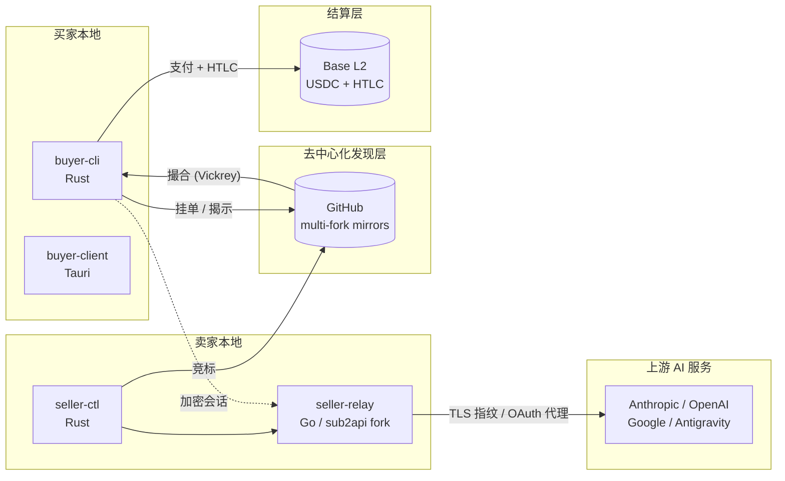
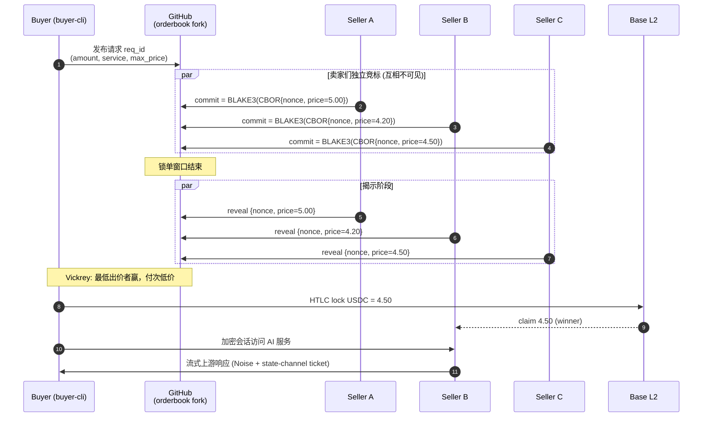

# AI Bazaar

**去中心化 AI 订阅二级市场的协议与参考实现**

把闲置的 Claude / OpenAI / Gemini / Antigravity 额度，
通过密封竞价匿名卖给需要的人 — 完全跑在 GitHub 上，端到端加密，链上结算。

[文档](#-文档入口) · [架构](#-架构概览) · [协议](docs/PROTOCOL.md) · [路线图](docs/ROADMAP.md) · [安全](SECURITY.md)

---

## ✨ 项目简介

> **替闲置的订阅额度找下家，替紧缺的需求找便宜货 — 中间没有平台抽成、没有数据泄露、没有信任前提。**

很多人买了 Claude Pro / GPT Plus / Gemini Advanced 但**用不完**；另一些人想用却**嫌贵**或**没渠道**。
传统中转站要求买卖双方都信任一个中心化运营方 — 平台拿走差价、保留所有交易数据、可以随时跑路。

**AI Bazaar 把这个市场拆成纯协议**：

- 🛰 **去中心化发现**：用 GitHub fork 网络分发挂单与撮合，不需要任何服务器
- 🔒 **密封竞价 (Vickrey)**：卖家互相看不到对方报价，买家自动拿到次低价
- 🔐 **端到端加密**：身份用 Ed25519 / X25519，订单和成交揭示全程加密
- ⚖️ **链上托管**：USDC + HTLC 在 Base L2 上结算，无单点
- 🌍 **本地程序**：买卖双方各自跑本地 CLI / GUI，没有云端账号

---

## 🎬 演示

> 演示素材将在 W7 (买家 CLI) 与 W8 (买家 GUI) 完成后补上。

<!--
插入位置示例（W7+ 完成后替换）：

视频版：
https://github.com/goday-org/ai-bazaar/assets/<id>/<video-id>.mp4
-->

  <em>(W7 之前先看下面的架构图与流程图)</em>

---

## 🏗 架构概览

**两套语言互不调用 FFI，通过 Unix Socket + JSON-RPC 通信**：

| 层 | 语言 | 关键依赖 |
|----|------|---------|
| 协议 / 加密 / 链 | Rust | ed25519-dalek, x25519-dalek, blake3, slip10_ed25519, alloy |
| 买家 GUI | Rust + Tauri | tauri 2.x, leptos |
| 卖家代理 | Go | utls (TLS 指纹), gin, ent, atlas |
| 合约 | Solidity | foundry, USDC, HTLC |

完整架构决策见 [`docs/ARCHITECTURE.md`](docs/ARCHITECTURE.md)（10 条 ADR）。

---

## ⚙️ 工作原理（一次成交）

- **winning_bid**: 4.20 USDC (S2 赢，因为它出价最低)
- **final_price**: 4.50 USDC (S2 实际拿到，等于第二低的价 — Vickrey 二价机制)

这种机制是博弈论上的「激励兼容」：卖家最优策略就是诚实报价，没有压价博弈空间。

详细协议（含字节级 commitment 构造 / 时序容忍 / 平局规则）见 [`docs/PROTOCOL.md`](docs/PROTOCOL.md)。

---

## 🛡 安全模型

| 关注点 | 机制 |
|--------|------|
| 身份 | Ed25519 (RFC 8032 严格签名) + SLIP-0010 BIP-39 24 词助记词 |
| 报价隐私 | BLAKE3-128 commitment + canonical CBOR + 锁单窗口 |
| 会话加密 | X25519 ECDH → Noise transport |
| 资金 | HTLC on Base L2，USDC 结算，state channel 累计扣费 |
| 私钥 | Rust struct: `Zeroize` + 自定义 `Debug` 抹除 |
| 助记词 | 仅 OS keychain，**绝不**落盘 / 进剪贴板 |
| 上游账号 | utls fingerprint + sticky session 反封号（fork 自 sub2api） |

资金安全边界、漏洞披露流程见 [`SECURITY.md`](SECURITY.md)。
**已知陷阱与红线**见 [`docs/PITFALLS.md`](docs/PITFALLS.md)。

---

## 📍 当前状态

| Milestone | 内容 | 状态 |
|-----------|------|------|
| W1-W2 | sub2api baseline + 剥离 | 🟡 进行中（已交接 Codex） |
| W3-W4 | 协议 crate + 跨语言一致性测试 | ⏳ |
| W5 | 链上合约 (HTLC + USDC) | ⏳ |
| W6 | buyer-cli (含 SLIP-0010 钱包) | ⏳ |
| W7 | 端到端单笔成交 demo | ⏳ |
| W8 | buyer-client Tauri GUI | ⏳ |
| W9 | seller-ctl 全功能 | ⏳ |
| W10 | 主网测试 + 公开 alpha | ⏳ |

完整路线图见 [`docs/ROADMAP.md`](docs/ROADMAP.md)，每周进度报告在 [`docs/progress/`](docs/progress/)。

---

## 📚 文档入口

**给主开发 (Codex)**：从 [`docs/HANDOFF.md`](docs/HANDOFF.md) 开始，按 §0 的强制顺序读。

**给 Reviewer / 关注者**：

| 文档 | 内容 |
|------|------|
| [`docs/ARCHITECTURE.md`](docs/ARCHITECTURE.md) | 10 条架构决策记录 (ADR) |
| [`docs/PROTOCOL.md`](docs/PROTOCOL.md) | 协议契约 (字节级精确) — **唯一真源** |
| [`docs/SUB2API_STRIP.md`](docs/SUB2API_STRIP.md) | sub2api fork 的 9 步剥离指南 |
| [`docs/PITFALLS.md`](docs/PITFALLS.md) | 致命陷阱清单（反封号 / 协议常量） |
| [`docs/ROADMAP.md`](docs/ROADMAP.md) | W1-W10 路线图与验收 |
| [`docs/REVIEW.md`](docs/REVIEW.md) | Review 检查点定义 (P0/P1/P2) |
| [`docs/GLOSSARY.md`](docs/GLOSSARY.md) | 术语表 |

---

## 🤝 参与方式

目前处于交接给单一开发者的 pre-alpha 阶段，暂不接受外部 PR。

- 发现协议设计问题：开 issue 标 `protocol-question`
- 安全漏洞：见 [`SECURITY.md`](SECURITY.md) 的私下披露流程
- 想关注进度：watch + star

未来开放贡献时会更新 [`CONTRIBUTING.md`](CONTRIBUTING.md)。

---

## ⚖️ 法律与风险

> ⚠️ **重要免责声明**

使用 AI Bazaar 协议**可能违反**第三方 AI 平台（Anthropic / OpenAI / Google）的服务条款。
本项目仅提供**协议规范与参考实现**，不运营任何中心化服务、不撮合具体交易、不持有用户资金。
任何使用者需自行评估法律与合规风险，自负其责。

本项目**明确反对**用于：欺诈、套利商业 API、规避平台风控、转售盗号订阅。

---

## 📜 License

[AGPL-3.0](LICENSE) — 衍生作品需开源、商业 SaaS 需公开服务端代码。

`seller-relay/` 子目录 fork 自 [Wei-Shaw/sub2api](https://github.com/Wei-Shaw/sub2api) (LGPL-3.0)，与 AGPL-3.0 兼容。

---

  Built with rigor by humans and an AI coding agent.  
  Protocol v0.1.0 · Last updated 2026-05

